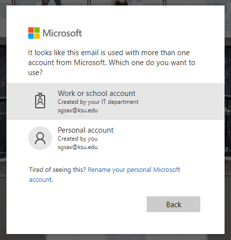

+++
title = "Installing Visual Studio"
date = 2018-08-24T10:53:05-05:00
weight = 10
chapter = true
pre = "<b>A2.1 </b>"
+++

## Installing Visual Studio

Visual Studio Enterprise 2019 is available on the machines we use
for CIS 300 labs. Students can also connect to these machines
remotely --- see [the CS Department Support
Wiki](https://support.cs.ksu.edu/CISDocs/wiki/Remote_Access#Remote_Windows_Access)
for details. However, if you are enrolled in CIS 300, you have free access
to this software to install on your own PC for your own personal
use. This section provides instructions for obtaining this software
from the Azure Portal and installing
it on your PC.

Visual Studio requires a Microsoft operating system such as
Windows 10. If you don't have a Microsoft operating system, you can
obtain one for free from the Azure Portal using the same process as
for obtain Visual Studio, as described below. You will need to install
the operating system either on a separate bootable partition or using
an emulator such as VMware Fusion. VMware Fusion is also available for
free through the VMware Academic Program --- see [the CS Department
Support Wiki](https://support.cs.ksu.edu/CISDocs/wiki/FAQ#VMWare) for
details.

To download Visual Studio Enterprise 2019, go to [Microsoft Azure Dev
Tools for Teaching](https://azureforeducation.microsoft.com/devtools),
and click the "Sign In" button. Then sign in to your Microsoft account
using your KSU email address. 

{}
If you don't have a Microsoft account,
you can create one using the "Create one!" link. Be sure to use your
KSU email address.
{}

{}
If you get a message resembing the
following, select the option labeled "Work or school account created
by your IT department":

{}

Once you have logged in, click on the "Software" link on the
left. Then type "Visual" into the search box below the "Education |
Software" heading. "Visual Studio Enterprise 2019" should then appear
in the list below the search box --- click this link. This should bring
up a window containing three buttons: "View Key", "Download", and
"Cancel". Before downloading the software, click "View Key" button,
and copy the key to a file so that you can retrieve it later.

{}
Copying the key is not strictly necessary at this point, as you can
always come back to this page. However, you will need the key to be
able to use the software for more than 30 days, and the installation
process will require your PC to restart. It therefore makes sense to
copy the key while you are here.
{}

Once you have copied the key, click the "Download" button to begin
downloading the installer. When the download has completed, run the
file you downloaded. This will start the installation process.

As the installation is beginning, you will be shown a window
asking for the components to be installed. Click the "Workloads" tab
in this window, and select ".NET desktop development" (under "Desktop
& Mobile"). You can select other workloads or components if you wish,
but this workload will install all you need for CIS 300.

The first time you run Visual Studio, you will be asked to sign in to
your Microsoft account. You can either do this or skip it by clicking,
"Not now, maybe later." You will
then be shown a window resembling the following:

Next to "Development Settings:", select "Visual C#". You can select
whichever color scheme you prefer.

Once Visual Studio has started, you should enter the product key (if
you didn't save it when you downloaded the software, go back to 
[Microsoft Azure Dev
Tools for Teaching](https://azureforeducation.microsoft.com/devtools)
and find it. Then in Visual Studio, go to the "Help" menu and select
"Register Product". Then enter your product key.

At this point, Visual Studio should be fully installed and ready to
use.
