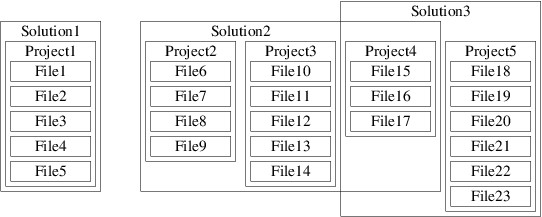

+++
title = "Visual Studio Solutions"
date = 2018-08-24T10:53:05-05:00
weight = 30
chapter = true
pre = "<b>A2.3. </b>"
+++

## Visual Studio Solutions

All code developed within Visual Studio 2019 must belong to one or more *solutions*. When you are using Visual Studio to develop a program, you will be working with a single solution. A solution will contain one or more *projects*. Each of these projects may belong to more than one solution. Each project typically contains several files, including source code files. Each file will typically belong to only one project. The following figure illustrates some of the possible relationships between solutions, projects, and files.



Note that in the above figure, Project4 is contained in both Solution2 and Solution3. In this section, we will focus on solutions that contain exactly one project, which in turn belongs to no other solutions (e.g., Solution1 in the above figure).

Whenever you clone a Git repository using Visual Studio 2019 (see [the previous section](/~rhowell/DataStructures/redirect/version-control)), the Visual Studio Solution Explorer will display the contents of the repository. In CIS 300, each repository will contain exactly one solution, whose name will have the suffix, ".sln". To open this solution, double-click on it. The Solution Explorer will now give you a view of the structure of your solution; for example, opening the solution in the repository given in the previous section will result in the following being shown in the Solution Explorer:


Near the top, just under the search box, is the name of the solution with an indication of how many projects it contains. Listed under the name of the solution is each project, together with the various components of the project. One of the projects is always shown in bold face. The bold face indicates that this project is the startup project; i.e., it is the project that the debugger will attempt to execute whenever it is invoked (for more details, see the section, "[The Debugger](/~rhowell/DataStructures/redirect/debugger)").

The project components having a suffix of ".cs" are C\# source code files. When a Windows Forms Application is created, its project will contain the following three source code files:

- **Form1.cs:** This file contains code that you will write in order to implement the main GUI for the application. It will be discussed in more detail in "[The Code Window](/~rhowell/DataStructures/redirect/code-window)".

- **Form1.Designer.cs:** You will need to click the triangle to the left of "Form1.cs" in the Solution Explorer in order to reveal this file name. This contains automatically-generated code that completes the definition of the main GUI. You will build this code indirectly by laying out the graphical components of GUI in the design window (see the section, "[The Design Window](/~rhowell/DataStructures/redirect/design-window)" for more details). Ordinarily, you will not need to look at the contents of this file.

- **Program.cs:** This file will contain something like the following:
```C#
    using System;
    using System.Collections.Generic;
    using System.Linq;
    using System.Threading.Tasks;
    using System.Windows.Forms;
    
    namespace Ksu.Cis300.HelloWorld
    {
        static class Program
        {
            /// <summary>
            /// The main entry point for the application.
            /// </summary>
            [STAThread]
            static void Main()
            {
                Application.EnableVisualStyles();
                Application.SetCompatibleTextRenderingDefault(false);
                Application.Run(new Form1());
            }
        }
    }
```

The **Main** method is where the application code begins. The last line of this method constructs a new instance of the class that implements the GUI. The call to [**Application.Run**](http://msdn.microsoft.com/en-us/library/ms157902\(v=vs.110\).aspx) displays the GUI and starts a loop that processes events such as mouse clicks and keystrokes. Ordinarily, there is no need to look at this code.

One of the first things you will need to do when starting a new Windows Forms Application is to change the name of Form1.cs, as this name (without the ".cs" suffix) is also the name of the class implementing the GUI. Therefore, it will need to be changed in order to conform to the [naming convention](/~rhowell/DataStructures/redirect/naming) for classes. To do this, right-click on its name in the Solution Explorer, and select "Rename" from the resulting popup menu. You will then be able to edit the name in the Solution Explorer. When you have entered the new name, the following window will be displayed:


You should click the "Yes" button in order to make the renaming consistent - particularly to rename the class as well.
