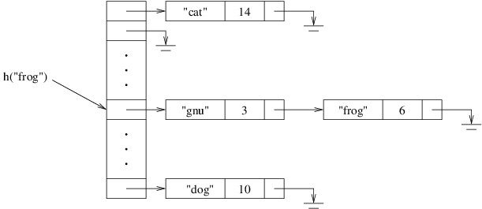

+++
title = "Hash Tables"
date = 2018-08-24T10:53:05-05:00
weight = 50
chapter = true
pre = "<b>7. </b>"
+++

## Hash Tables

Throughout our discussion of dictionaries over the last three chapters,
we have taken advantage of the fact that the keys were sorted when
looking up specific keys. In this chapter, we examine a rather
surprising result --- that we can achieve better performance if we don't
have to keep the keys in any particular order (i.e., so that we can
process them in that order). The technique uses a data structure known
as a *hash table*, which is the underlying data structure in the .NET
Framework's **Dictionary\<TKey,TValue\>** class.

A hash table is typically organized as an array of linked lists. The
individual cells in the linked lists each store a key and a value.
Associated with this structure is a *hash function*, which takes a key
as its parameter and computes an array location. This array location
contains a reference to the beginning of the linked list that will
contain the given key if it is in the hash table. Thus, in order to find
a key in a hash table, we first apply the hash function to the key, then
search the linked list at the location computed by the hash function.
The following picture illustrates the layout of a hash table in which
the keys are **string**s and the values are **int**s, and the hash
function is denoted by *h*:

{}

In order to avoid cluttering the above picture, the **string**s are
shown inside the linked list cells, even though **string** is a
reference type.

{}

In order to achieve good performance, we want all of the linked lists to
be short. This requires, among other things, that we make the array
sufficiently large. We therefore increase the size of the array as the
number of elements increases.

The above overview of hash tables reveals one of the challenges in using
a dictionary implemented using a hash table. Specifically, whenever we
define a new key type, this type is unknown to the dictionary
implementation. How then can it compute a hash function on an instance
of this type? The short answer to this question is that the hash
function is divided into two parts. The first part of the hash function
is implemented within the key type itself, where code can access the
implementation details of the key. Specifically, every type in C# has a
**public**
[**GetHashCode**](https://docs.microsoft.com/en-us/dotnet/api/system.object.gethashcode?view=netframework-4.7.2#System_Object_GetHashCode)
method, which takes no parameters and returns an **int**. Any new type
that redefines how its elements are compared for equality should
*override* this method so as to ensure that it returns the same value
whenever it is called on equal instances. The second part of the hash
function is implemented within the dictionary itself. This part takes
the **int** from the first part and uses it to compute an array
location. We will discuss both parts of the hash function computation in
more detail in later sections.

In the next few sections, we will present the implementation details of
a hash table. We will then discuss how a dictionary can facilitate a
technique called *memoization*, which can be used to improve
dramatically the performance of certain algorithms. This discussion will
provide a motivation for defining a new key type. We then take a close
look at how equality is handled in C#, as we will need to be able to
implement equality tests if we are to define new types that can be used
as keys. We then complete the discussion on defining new key types by
illustrating how the **GetHashCode** method can be implemented.
