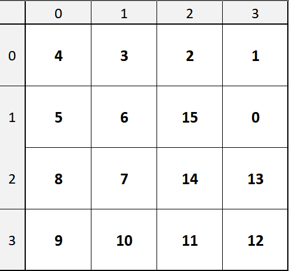
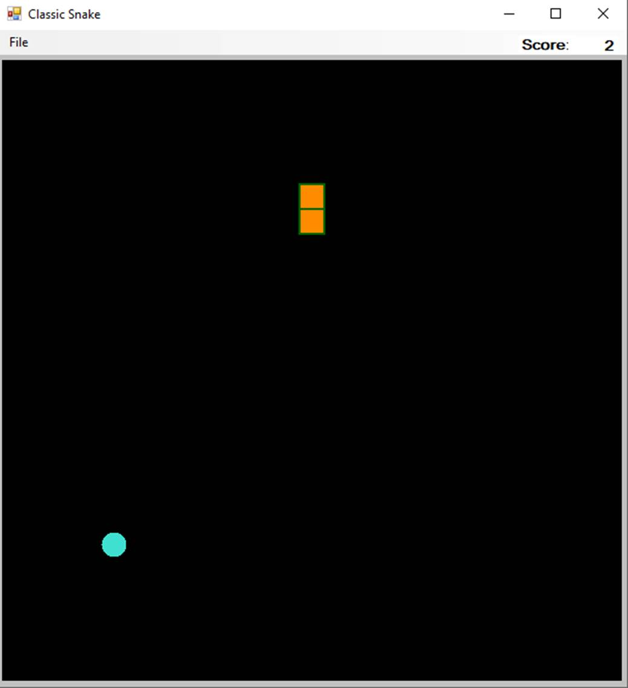

# User Requirements

For this assignment, you will be creating a video game classic: Snake.  Snake was originally a cellphone game launched on the Nokia in the late ‘90s.  In its simplest form, you control a snake that can go up, left, right, or down.  The game board also contains one piece of snake food at a random location. When the snake eats this food, points are awarded, a new piece of food is generated an a random unoccupied location, and the snake body grows. The goal is to eat as much snake food as you can. If the snake runs into the edge of the screen or a section of itself, the game is over.

The game you will construct has two modes. The first mode is the normal video game mode in which a user plays until the game ends. The second mode is an AI that plays without user input and always maximizes its score.

## The Perfect Snake AI

AI for Snake is a solved problem.  There are many different approaches, some seem seemingly more random than others, but there exist solutions that produce an AI player that always plays until the snake fills the entire board.  One solution to this problem is generating a [Hamiltonian cycle](https://en.wikipedia.org/wiki/Hamiltonian_path).  A Hamiltonian cycle is a path that visits all nodes in a graph exactly once before returning to the beginning of path.  This path does not necessarily include all edges in the graph.  We can generate a Hamiltonian cycle for Snake if we split our game space out into an **n x n** grid, where each grid square represents a graph node that has edges to each adjacent node (vertically or horizontally, but not diagonally).  

Verifying that a Hamiltonian cycle exists in a graph is [NP-complete](https://en.wikipedia.org/wiki/NP-completeness). NP-completeness is a deep theoretical concept, but as of this writing there are no known algorithms for solving any NP-complete problem in $O(n^k)$ time for any fixed $k$, and most experts believe it is impossible to find such an algorithm.  In terms of running time, that does not bode well for an AI player which should be able to execute moves in a game in real time.  Likewise, not all Hamiltonian cycles will result to a guaranteed win in Snake (some end up causing the snake to trap itself).  However, if we find a Hamiltonian cycle from the head of the snake through its tail, then through the snake itself to its head, we can be sure the snake will never trap itself.  And if the AI just follows this path until it wins (the snake fills the entire screen), we only need to calculate this path at the beginning of the game.  This works on the assumption that the game's grid is of even width and height; otherwise, there may not always be a Hamiltonian path.

### Generating a Hamiltonian Path

The path for the AI to follow can be found by building a path incrementally. We  start by finding a shortest path from the head of the snake to its tail (it cannot traverse through itself to get to the tail). To find the Hamiltonian path from our shortest path, we can slowly extend each portion of the path (starting at the head) in perpendicular directions (if the path is going up or down, try to extend the path left or right and vice versa).  If the path is able to be extended in a direction, we continue one step parallel to the original path, then return to the original path by going in the direction opposite of the extension we inserted. Note that if we represent a path as a list of directions, this amounts to inserting directions before and after the direction that follows our current location. These inserted directions are opposite each other. 

If the path cannot be extended any farther, move on to the next position in the path. This continues until no part of the path can be extended. Then, if we just connect the path to the rest of the snake, we have a complete Hamiltonian path that starts at the head and ends at the tail.  Following this path will allow the Snake AI to constantly chase its tail, preventing it from ever being trapped.  Below is an example of this process on a 4x4 game. 


1. The shortest path is found from (H)ead to (T)ail. 
2. Since the path from H was going left, we try (and do) extend the path up (see that "up" is inserted before "left", and the opposite --- "down" --- is inserted after "left").  
3. The current direction from H is up, so we can extend the path to the right.
4. In this step, we progressed all the way to node (1,0) (*note that the top row of numbers in the figures is the x-coordinate and the left is the y-coordinate*) because the path at H cannot be extended, so we follow the path until we come to a node where the path can be extended (1,0). The path at this location is extended left.
5. The algorithm progresses to node (1,2) where the path can be extended down.
6. The path gets extended again at (1,2), but this time, left.
7. The algorithm progresses to (2,3) where the path gets extended right.
8. In this step, the main algorithm finishes before the last direction is added to the path.  The main algorithm ends here since we have reached the end of the path (in blue), but in order for it to be a true Hamiltonian cycle, we need to include the rest of the snake in the path so we traverse the snake from the tail to add the remaining direction to the path. 

The resulting path is traversed in order of number continuously by the AI in order to solve the game.  The ordering can be seen laid on top of the grid below:



An example of the AI working can be found below (url: https://www.youtube.com/watch?v=yXLp50i8Olk):

<iframe width="375" height="375" src="https://www.youtube.com/embed/yXLp50i8Olk" frameborder="0" allow="accelerometer; autoplay; clipboard-write; encrypted-media; gyroscope; picture-in-picture" allowfullscreen></iframe>

# Starting the Assignment

Create a GitHub repository using [**this URL**](https://classroom.github.com/a/Ejrbwlrr). This repository will contain a skeleton Windows Forms application.

# User Interface



The user interface is fairly simple.  At the top, there is a **MenuStrip** that has one menu, File. This menu contains a single item, **New Game**, which in turn has a sub-menu with **Easy**, **Normal**, and **Hard** as options.  Clicking one of these sub-menu items will start a new game of that difficulty.  When a new game option is clicked, the game is reset with a snake of size 2 in the center and started automatically (the snake starts moving upward on its own). If the **CheckBox** for the AI player is checked when a new game is created, then the AI player will take control of the snake.  During this mode, the human should not be able to control the snake. If this box in not checked, the user will be able to control the direction the snake is moving using the arrow keys.

In the top right hand corner, there are two labels that will be used to keep track of the player’s score.  The **Label** in the top right-hand corner is used for the score itself.  The **AutoSize** property should be set to **false** (this will let you size it yourself).  The text **size** should be adjusted for both of the Labels and the font should be **bolded**.   Both of these labels should be **anchored** to the top and the right.

The main part of the form (the black area) is a **PictureBox**.  You do not need to worry about sizing this control as it will be done programmatically.  Lastly, for the **Form** control AND the **CheckBox** control, be sure to set the **KeyPreview** property to **True**.  This is very important.  Without this, the arrow keys will not register the correct event handlers.  This lets the user control the snake with the arrow keys regardless of which control has focus (clicked on, etc.).  If this is not set, when the Score is updated, the controls for the snake will not register properly.

# Tasks

This project takes a simple approach to creating a game in C# that can perform background tasks (the game logic) and update the UI (visuals and controls of the game) at the same time. To do this in C#, we will use async/await and Tasks to prevent the GUI from being frozen.  To learn more about these topics, please watch/read the following (some of these are  for reference, some are for learning):

1. [Microsoft video on understanding basics of async ](https://channel9.msdn.com/Series/Three-Essential-Tips-for-Async/Three-Essential-Tips-For-Async-Introduction)
2. [Example tutorial on async and await ](https://www.youtube.com/watch?v=C5VhaxQWcpE)                   
3. [Best practices using async/await ](https://msdn.microsoft.com/en-us/magazine/jj991977.aspx)
4. [Microsoft documentation examples on using Tasks](https://docs.microsoft.com/en-us/dotnet/standard/parallel-programming/task-based-asynchronous-programming)
5. [Microsoft documentation examples on async ](https://docs.microsoft.com/en-us/dotnet/csharp/programming-guide/concepts/async/)
6. [Gotchyas on using async/await with UIs](http://nikolar.com/2013/09/02/asynchronously-deadlocked-or-do-not-wrap-async-methods-into-sync-wrappers-httpclient-getasync-not-returning/)
7. [WaitAny documentation ](https://docs.microsoft.com/en-us/dotnet/api/system.threading.tasks.task.waitany?view=netframework-4.7.2)
8. [Aditional tutorial on async](https://www.dotnetperls.com/async)

# Software Architecture


You do not need to use the same names as shown in the class diagram, as long as you follow the [naming conventions](https://cis300.cs.ksu.edu/appendix/style/naming/) for CIS 300. You may add any **private** methods that you feel improve the code.  

# Coding Requirements

The below are the classes, methods, and functionality for the Snake game.  There are three enumerations that you can see above.  These do not have to go in any particular file, but they should **not** be a part of any class definition.  They just need to belong to the namespace.

## The GameNode Class

This class is a simple object that serves as a node in the graph that represents the game board.  It does not contain any functionality beyond the noted properties and constructor.

### Properties

*Note that each of the following properties have default get and set accessors.*

- `public int Y`
  - The y-coordinate for this node
- `public int X`
  - The x-coordinate for this node
- `public GridData Data`
  - The information stored at this node.  This is an enumeration which makes it cheap and efficient for storing game “objects” at locations.  Each node is only allowed to have a single piece of the game at any time.  For example, a node cannot have the snake and snake food together.  
- `public GameNode SnakeEdge`
    - This edge represents a connection in the graph to another GameNode.  In the  game, it is used only to connect the snake pieces on the GameBoard leading in the direction from the tail to the head.

### Methods

- `public GameNode(int x, int y)`
  - This is the default constructor that sets the x-y coordinate properties above.
- You may also override the ToString method to allow for easier debugging (show the x,y coordinate with the data stored).

## The GameBoard Class

This class contains the majority of the game’s logic.  It keeps information about the game board and is responsible for making the snake grow or move into a new place on the board.  The game board is setup as an array of **GameNode**s forming an undirected graph.  This is what will be used to know the location of game objects like the snake and the food.  In addition to this, nodes that contain the snake will also have additional graph information to track the direction of the snake.  This is an added efficiency to make constructing the snake faster than scanning the entire grid every time for each snake section.  Note that the UI does not really interact with the **GameBoard** class directly.  The Game class, discussed next, will be the middle ground communication.

### Properties

- `public GameNode Food`
  - This is a property that has public get and set accessors.  This will return the game node that contains the food.  This is intended to make the drawing of the food easier on the UI.
- `public GameNode[,] Grid`
  - This is a property that has a public get accessor and a private set accessor. This is the array for storing the nodes of the game board.
- `public GameNode Head`
  - This is a property that has public get and set accessors.  It maintains a reference to where the head of the snake is currently located.
- `public GameNode Tail`
  - This is a property that has public get and set accessors.  It maintains a reference to where the tail of the snake is currently located.
- `public int SnakeSize`
  - This is a property that has a public get accessor and  a private set accessor.  It keeps track of how big the snake is at any given time.

### Fields

- `private int _size`
  - This field keeps track of the dimension (n) of the board.
- `private Direction[] _aiDirection`
  - This array contains all four possible directions to make it easier to find adjacent nodes to search when finding the shortest path in the board.  My order is up, left, right, down...but this should not impact functionality, just the path order your snake AI takes.
- `private Direction[] _lr` and `private Direction[] _ud`
  - These arrays contain the directions left, right and up down respectively.  These are used for determining which directions the AI can use to extend the path when calculating the Hamiltonian path.

### Methods

- `public GameBoard(int size)`
  
  - This is a constructor that initializes the game board to a new board of the given size.  Each node should be initialized with its x-y location, but nothing else.  Once the board is made, then the head and tail should be placed in its center.  This will be slightly off-center if the board is of even size.  Be sure to set the data of this node to be the snake head and store a reference to the node in the head and tail fields.  Then, add the food to the board by using the method below.
  
- `public void AddFood()`
  
  - This method randomly places the snake food on the board. This is done by setting data of a random node to be SnakeFood.  The food cannot be placed in a node unless it is empty.  Be sure to store the reference to the node you place the food in the **Food** property above.
  
- `public GameNode GetNextNode(Direction dir)`
  
  - This is a helper method that will return the node that the snake would be going to if it were headed in the given direction.  The method should return **null** if the snake would move off of the board.
  
- `public SnakeStatus MoveSnake(Direction dir)`
  
  - This is the main logic on how the snake moves through the game board.  First, get the next node using the method above.  If the node is **null**, return that a collision happened (`SnakeStatus.Collision`).  If the next node is the node immediately before the snake head, then the user pressed an invalid direction.  Return the InvalidDirection snake status.  If the next node has part of the snake body, return that there was a collision.  
  
    If none of the above are true, then the snake can move forward into the next node.  To do this, make the next node to be the snake head, the current head to be part of the snake body, and link the edge of the current head to the next node.  If the data in the node where the snake is moving to contains the food, add a new piece of food to the board and return that the snake is eating. Note that if the game is won (the snake fills the entire grid), then no food should be added and a Win status should be returned.
  
    If the snake is not eating and it did not collide with something, then we need to determine if we need to cut the snake’s tail.  If we do not do this, the snake will continuously grow even if it is not eating.  If the head of the snake is not the tail of the snake, set the tail node data to be empty.  Then, the edge of the tail should be set to null and the value of the edge should become the new tail.  This process can be done with a temporary variable.  In the method above, no new game nodes should be created.  
  
- `public List<GameNode> GetSnakePath()`
  
  - This method returns a list of game nodes that contain the snake starting from the tail.
  
- `private List<Direction> BuildPath(Dictionary<GameNode, (GameNode, Direction)> path, GameNode dest)`

  - This method reverses the given path from the destination to the head of the snake.  The resulting list is a series of directions that leads the head of the snake to `dest`.  This method works similarly to the **AddPath** method in [Lab 33](https://classroom.github.com/a/dT-eocng).  The given path dictionary's keys represent the destination and the corresponding value is a tuple which has the source node and the direction required to go to get to the destination.

- `public List<Direction> FindShortestAiPath(GameNode dest)`

  - This method calculates the shortest path from the head of the snake to the destination.  This method works similarly to the shortest path algorithm in [Lab34](https://classroom.github.com/a/tRS1oXkz).  The path should be kept in a dictionary as described in the previous method.  The queue should contain a 3-value tuple which contains the source node, destination node, and the direction required to get from the source to the destination.  This tuple represents an edge between two adjacent nodes. A helper method is recommended here to find the adjacent edges from a given source node.  Note that only valid adjacent nodes should be included as a valid edge (i.e. parts of the snake should not be included, unless the destination of the shortest path is the tail, then the tail can be included).  The snake is not allowed to path back over itself to reach its destination. Once the destination is found, rebuild and return the path using the `BuildPath` method.

- `public List<Direction> FindLongestAiPath()`

  - This method is used to find the Hamiltonian path as described in the "The Perfect Snake AI" sections.  Utilize the `FindShortestAiPath` to find a path to the tail of the snake.  Then use the process previously described to extend this path.  You will need to keep track of which nodes you have visited (be sure to mark all in the shortest path to be visited before you start extending it). You will need to keep track of which node you are currently at and which direction in the path you are currently at (and which node that leads to).  If the current direction you are at in the path is up or down, try to extend the path left or right (up or down if the direction in the path is left or right).  If you can extend the current node and the next node (the node the current direction leads to) in either of the extension directions, then insert the direction and its opposite into the path (at the current location in the path and current location + 2 respectively).  Note that you cannot extend to a location that has already been visited.   If the path cannot be extended at its current location, advance to the next node, otherwise, keep trying to extend the current node. Once you have reached the end of the path (this should  be the tail), link the path to the rest of the snake and return the path

## The Game Class

The game class is the communication between the UI and the game logic.  It will maintain the status of the game and manage moving the snake based off the key presses given by the UI.  This class implements the **INotifyPropertyChanged** interface.  

### Fields

- `private int _score`
    - Keeps track of how many points the player has.
- `private int _delay`
    - Indicates how many milliseconds the game should wait before ticks (controls how fast the snake moves)
- `private bool _isAI`
    - Indicates if the game should be controlled by the AI
- `private int _pathIdx`
    - This keeps track of the position (index) in the AI is current at in the AI's path.
- `private List<Direction> _aiPath`
    - This will store the AI path, if the AI is enabled.

### Properties

- `public bool Play`

    - Stores whether or not the game is currently being played (i.e. the game is not over)

- `public int Score`

    - This is a public property that has a get accessor that returns the private score field.  The set accessor is a bit unique.  This is the first step in implementing data binding.

        

        Data binding works by linking a data source (the Binding Source) of some kind to another object (the Binding Target).  This is done in C# between a data source and a UI control.  In data binding, when the source property changes, the target is notified of this change.  This is extremely useful in the sense that we do not have to update a UI control manually.  This will take care of it for us.  In the set accessor, check if the private score field is different from the new value given to the property.  If it is, set the private score field to the value and then call **OnPropertyChanged**, passing in the name of the property that changed as a string (“Score”).  This signals an event (see below for definition) that will trigger the data binding process. 

- `public GameBoard Board`

    - The reference to the game board object that contains the logic for moving the snake on the graph. The property has default get and private set accessors.
- `public int Size`

    - The size of the game to create. The property has default get and a private set accessors.
- `public Direction LastDirection`

    - The last direction that the snake successfully moved. The property has default get and set accessors.
- `public Direction KeyPress`

    - The most recent direction reported by the UI. The property has default get and private set accessors.
- `public SnakeStatus Status`

    - The current status of the snake. The property has default get and private set accessors.
- `public event PropertyChangedEventHandler PropertyChanged;`

    - This is needed as part of implementing the above-mentioned interface.  The above line can be inserted verbatim into your code.

### Methods

- `public Game(int size, int speed, bool isAI)`

    - The constructor for the Game class.  Sets the size, initializes the game board, score to 2, and Play to true. Once the board is initialized, the snake should be moved up one (use `MoveSnake`).  The constructor should also set the `_delay` based off the given speed.  If the AI is enabled, set `_aiPath` to the result of the `FindAiPath` method from the GameBoard class and set the `_delay` to be a 10th of the given speed (this will speed up the AI, but give the human player reasonable reaction time).

- `public async Task StartMoving(IProgress<SnakeStatus> progress, CancellationToken cancelToken)`

    - This is an asynchronous method that acts as a game clock.  The snake in the game is always moving, the user (or AI) only controls the direction.  Therefore, every game “tick” we need to move the snake.  Since this is asynchronous, it will not block the UI completely.  This method contains a loop that continues until Play is false or a cancelation request has been made from the UI (`cancelToken.IsCancellationRequested`).  Inside the loop, you will tell the game board (**Board**) to move the snake in the direction of **KeyPress**.  Then you will report the new status back to the UI using the progress interface passed to this method.  This can be done using `progress.Report(Status)`  If the snake collided with something, **Play** should be set to false.  If the snake is still moving, the last direction should be set to the key press.  If the snake is eating, increase the score (be sure to use the property here so it triggers the data binding events).  If the snake reported an invalid direction, try to move the snake in the last direction (be sure to check for collisions and eating here as well.  If a win status is reported, still increase the score by 1, but set Play to false.  Lastly, at the end of the loop, use the following code to control how often a tick occurs:  `await Task.Delay(_delay)`.
    - To add the AI control, add a check at the beginning of the loop to see if the AI is enabled, if so, override the `KeyPress ` value with the direction stored at the current position in the path.  If you hit the end of the path, reset the position to 0. 

- `private void OnPropertyChanged(string propertyName)`

    - This is what will call the property changed event with the appropriate property.  This method should contain only the following code:

        ``````c#
        PropertyChanged?.Invoke(this, new PropertyChangedEventArgs(propertyName));
        ``````

        This is checking if the `PropertyChanged` is null.  If not, it will call the property changed event for the given property in context of “this”.

- `public List<GameNode> GetSnakePath()`

    - This method returns the result of the GetSnakePath method contained in the GameBoard class.
- `public GameNode GetFood()`

    - Returns the Food property of the game board.  If the Food property doesn't actually contain food, return null (this happens when the game is won and the snake fills the entire board).
- `public void MoveUp()`

    - Sets the key press field to be the up direction.
- `public void MoveDown()`

    - Sets the key press field to be the down direction.
- `public void MoveLeft()`

    - Sets the key press field to be the left direction.
- `public void MoveRight()`

    - Sets the key press field to be the right direction.

## The UserInterface Class

The user interface class is responsible for handling the event where a key is down as well as drawing the snake and other game data on the screen.

### Fields

- `private int _squareWidth`
    - This is the calculated size of a game square (a node on the graph).
- `private int _size`
    - The width and height of the game in number of nodes/game squares.
- `private Game _game`
    - The game object.  This gives the UI access to informing the game when the user has changed directions, as well as letting the game inform the UI of the score and where the snake is.
- `private SolidBrush _bodyBrush`
    - This field is initialized to a new **SolidBrush**, passing a Color of your choice as a parameter.  This will be used to give the snake color. 
- `private SolidBrush _foodBrush`
    - Same as above, but used to color the food.
- `private Pen _pen`
    - This is what gives each snake square an outline.  Initialize it to a new pen with a color of your choice and a width of 2.
- `private CancellationTokenSource _cancelSource`
    - This field will allow the **UserInterface** to cancel or stop the `async StartMoving` method in the Game class.  Without this, if a new game is started before the previous one ends, the thread that was running the previous game will continue to run in the background. This field should be initialized to a new `CancellationTokenSource`

### Methods

- `public UserInterface()`

    - This is the default constructor that simply calls the **NewGame** method below.

- `private void NewGame(int size, int speed)`

    - This creates a new game with the given size and speed.  This also sets the width and height of the picture box in the UI to 600.  You can change this size, but this seems to be a good balance on a standard resolution monitor.  You will also need to change the Size property of this (the form) to be a new size taking into account the picture box and the menu strip.  The square width should be calculated to be the picture box width divided by the size.  You also need to setup the databinding to the score label.  This can be done by clearing the `DataBindings` property of the score label control, then calling Add on the same property to add a new Binding.  The parameters you pass when creating the new Binding object should be “Text” (this is the property of the label you are binding to), the **_game** field (the object that has your data), and “Score”, the name of the property in the data which will be your source.  Then you need to create a new progress object (you may use the code below).  Before you tell the game to start moving, set the `_cancelSource` to a new instance, then call the `StartMoving` method, passing the progress object and `_cancelSource.Token`.  This token allows the UI to communicate to the `StartMoving` method when a new game is created.  Be sure to add `_cancelSource.Cancel();` at the beginning of the this method (**NewGame**) so that any previous games are completely stopped before a new one is started.

        ```c#
        //this line of code goes inside the NewGame method
        progress.ProgressChanged += new EventHandler<SnakeStatus>(CheckProgress);
        
        //this method goes outside of the NewGame method
        private void CheckProgress(object sender, SnakeStatus status)
        {
            //Note that the Refresh call invalidates the state of the controls, forcing them to be redrawn.
            Refresh();
            if (status == SnakeStatus.Collision)
            {
                MessageBox.Show("Game over!");
            }
            else if (status == SnakeStatus.Win)
            {
                MessageBox.Show("Game Completed!");
            }
        }
        ```

- `private void uxPictureBox_Paint(object sender, PaintEventArgs e)`

    - This is an event handler that will draw all of the game graphics.  Be sure to assign this as the Paint event handler in the UI designer window for your picture box.  It is pretty straight forward to draw graphics is C#.  In this method, get the graphics object into a local Graphics variable.  The graphics object that belongs this control is contained the arguments (`e.Graphics`).  Then get the snake path through the game class.  For each of the game nodes in the snake path, we will create a new rectangle.  This rectangle is located at the coordinates of the node times the square width.  The width and height of the rectangle is the square width field.  Then to draw the rectangle, call the **FillRectangle** method of the graphics object, passing in the body brush and the rectangle as parameters.  Then we draw the outline, using the **DrawRectangle** method of the graphics object, passing in the pen and rectangle as parameters.  Finally, after the snake is drawn, we need to draw the food.  Get the food node through the game class and draw it just like the snake, but use **FillEllipse** instead.  This will draw it as a circle. *(Note that if the food is null, it should not be drawn)*

- `private void UserInterface_KeyDown(object sender, KeyEventArgs e)`

    - This is a **KeyDown** event handler which should be hooked to your Form control AND your AI CheckBox in your UI designer window (*Note that this is because the CheckBox can receive focus and can block the Form from triggering the event otherwise*).  If the game is still active, it will call the correct move function through the game class.  You can get what key was pressed by using `e.KeyCode` and compare that to `Keys.Up` etc..  After the key press was sent on, the picture box needs to be redrawn.  This can be triggered by using uxPictureBox.Refresh();

- Add three click event handlers corresponding to the New Game -> Easy, Normal, and Hard menu items.  Each should create a `NewGame` with the following parameters:

    - Easy: size 10 and speed 250
    - Normal: size 20 and speed 150
    - Hard: size 30 and speed 100

- Finally, add the following event handler, hooking it as a **PreviewKeyDown** event handler for both the **Form** control AND the **CheckBox**.  This enables the use of the arrow keys, otherwise they will not trigger the **KeyDown** event.

    ```c#
    private void UserInterface_PreviewKeyDown(object sender, PreviewKeyDownEventArgs e)
    {
    	e.IsInputKey = true;
    }
    ```

# Testing and Performance

Unit tests are provided to test *basic* functionality but they do not test UI elements, async elements, or keyboard interactions directly.  These will need to be tested manually.  The graphics should be redrawn smoothly with nearly no interruption to the user control (which should never be locked up). The game should work without bugs or crashes and follow game rules.  The AI should not cause any delays and should win the game every time. 

# Submitting Your Assignment

Be sure to **refresh** your Team Explorer, **commit** all your changes, then **push** your commits to your GitHub repository. Then submit the *entire URL* of the commit that you want graded.

**Important:** If the URL you submit does not contain the 40-hex-digit fingerprint of the commit you want graded, **you will receive a 0**, as this fingerprint is the only way we can verify that you completed your code prior to submitting your assignment. We will only grade the source code that is included in the commit that you submit. 