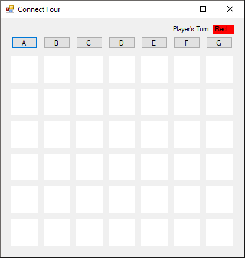
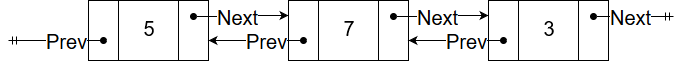

## User Requirements

This assignment will focus on the game called Connect Four, also referred to as four in a row or four in a line.  It is a two player game where each player takes turns in placing chips in a vertically standing board that has **six** rows and **seven** columns. The person who gets four of their chips in a row (diagonally, vertically, or horizontally) wins.  This game can also be drawn.  If the board fills up without either player getting four in a row or if there are no more moves left that enable a player to win, then that game is considered a draw.  For the purposes of this assignment, you only need to worry about a draw when the board is full.  You will be writing a program that lets two humans play against each other in a game of Connect Four.

[](http://www.abstractstrategy.com/connect-four.jpg)

## Starting the Assignment

Begin by creating a GitHub repository using [**this URL** ](https://classroom.github.com/a/OfTD0kxQ), and clone it to your local machine. This repository contains a new Windows Forms Application and test cases.

## User Interface

The initial user interface of the game is quite bare.  Before the program executes, the interface should look like this:


You can see that it is quite empty.  This is because most of the UI is going to be added dynamically at run time.  This image shows what you need to build in the Designer window in Visual Studio.  The rest will be added through code later.  The form should be locked from being able to be resized (set the `FormBorderStyle` property for the form to *FixedSingle*).  The overall form should be about 430 wide by 440 tall.  The initial interface has three **[FlowLayoutPanel](https://docs.microsoft.com/en-us/dotnet/api/system.windows.forms.flowlayoutpanel?view=net-5.0)**s  that will help organize our dynamic controls once they are loaded.

- The top **FlowLayoutPanel** has two **Label**s that keep track of the user's turn.  Note that to turn the background color of a **Label** to white, modify the **BackColor** property.  The **FlowDirection** property of this panel should be set to flow from right to left. 
- The second **FlowLayoutPanel** will contain all of the buttons that will place game pieces on the board.  The **FlowDirection** property of this panel should be set to flow from left to right.
- The bottom **FlowLayoutPanel** will be used to contain all of the **Label**s that represent the slots on the Connect Four board. The **FlowDirection** property of this panel should be set to flow from top down.

The final user interface once the game is loaded should look like the following:



Instructions for populating the UI at run time will be found below.

The interactions with the UI, overall, are quite simple.  Each of the place buttons above each column should be bound to the `uxPlaceButtonClick` method described later in this assignment.  This will cause a chip (`GamePiece`) to be placed in the last available slot.  This chip should be the same color as the Player.  After each click of a place button, the next player gets their turn.   The label in the top right hand corner of the UI indicates who's turn it is by using a label filled with the text and color of that player.  Once a player wins or the game is a draw, a message box should appear stating who won the game.  Once the user presses OK, the program should exit.

## Software Architecture

Your program should contain these four classes, as shown in the following class diagram.  Each class will 


## Doubly Linked Lists

We have done a lot of work with single linked lists thus far.  A major drawback of the single linked list data structure is that you can only traverse the structure in a single direction.  This doesn't make it very flexible.  To solve this problem, we can use a **double** **linked list**.  The cells that make up the linked list are very similar to the single linked list, but in addition to the pointer to the next cell in the list, it also contains a reference to the previous cell in the list like so:



### Representing the Board

The game board will be represented by using only double linked lists.  Each cell on the board is stored in a **DoubleLinkedListCell\<GamePiece\>** in each column. The occupied cells of a single column are linked together into a doubly linked list.  For each of these columns, you will have a **DoubleLinkedListCell\<DoubleLinkedListCell\<GamePiece\>\>** whose **Data** property contains the **DoubleLinkedListCell\<GamePiece\>** at the top of the column.   Below is an example of a game where the red player wins diagonally (last piece placed was in column D), along with what the game looks like as the double linked lists:


See that the cells in each row are **not** connected to the adjacent columns.  This means that in order to get to a particular cell, you will have to find the correct column first.  This is not the most efficient representation of the Connect Four game board; however, its designed as an exercise to test your ability to navigate through linked lists and work with references.

## Code Requirements

Your program should be organized into the following classes.  Note that many things here are made public (not all) in order to improve accessibility for unit testing. It is important to name everything as listed since the provided unit tests will be expecting them as such.  You may add additional private methods to any of the classes that help you with your implementation.

### DoubleLinkedListCell Class

This is a **generic** class that represents a cell in a doubly linked list as described above in "Doubly Linked Lists."  Note that the **Id** of the cell varies depending on where the cell was created.  Cells that represent a slot on the game board should have an **Id** that contains the column letter and the row number, ex: "A4".  The cells that are made in the constructor of the **Game** class keep track of only columns; therefore, these cells with have an **Id** that only has the column letter, ex: "A".

#### Properties

- `public DoubleLinkedListCell<T> Next`: The publicly accessibly property that is a reference to the next cell in the list.  This should have both get and set accessors using the default implementation.

- `public DoubleLinkedListCell<T> Previous`: The publicly accessibly property that stores a reference to the previous cell in the list.  This should have both get and set accessors using the default implementation.
- `public T Data`: The publicly accessibly property for storing the information in this cell.  This should have both get and set accessors using the default implementation
- `public string Id`: The publicly accessibly property that is the unique identifier for the cell (see above for description).  This should have both get and set accessors using the default implementation

#### Constructors

- `public DoubleLinkedListCell(string identifier)`:  The public constructor for the DoubleLinkedListCell class.  It should set `Id` to the given identifier string.

### GamePiece Class

The **GamePiece** class is a public class that represents a chip the player places in the board:

#### Properties

- `public Color PieceColor`: The public property that keeps track of what color this game piece is.  This should have both get and set accessors using the default implementation
- `public int Row`: The public property that keeps track of the row that this game piece is associated with.  This should have both get and set accessors using the default implementation
- `public char Column`: The public property that keeps track of which column this game piece is in.  This should have both get and set accessors using the default implementation

#### Constructors

- `public GamePiece(Color color, int row, char column)`:  The public constructor to the GamePiece class.  It should initialize each of the  GamePiece properties above.

### PlayersTurn  Enum

An enumeration to make it easier to identify who's turn it is.  Should contain Red and Black.  The [**enum** ](https://docs.microsoft.com/en-us/dotnet/csharp/language-reference/keywords/enum) keyword is used to declare an [enumeration](http://people.cs.ksu.edu/~rhowell/DataStructures/syntax/enumerations.html).  An enumeration is a type that consists of a set of named constants.  The first name (in this case Red) would have a value of 0, the second, a value of 1, and so on.  But instead of using numbers to compare, we can just use the canonical representation (i.e. Red and Black).  The *PlayersTurn* enumerator can be declared like:

```c#
public enum PlayersTurn
{
	Red,
	Black
}
```

This enum should be placed directly inside the namespace and **not** inside of a class.

### Game Class

The **Game** class is a public class to represent the game board.

#### Fields

- `public const int ColumnSize`:  The number of slots in each column.  This should be set to 6.  The [**const**](https://docs.microsoft.com/en-us/dotnet/csharp/language-reference/keywords/const) keyword is used to declare a constant.  A constant field *cannot* be changed or modified once it is declared.
- `public const string ColumnLabels`: A string that represents all of the column labels.  This should be set to *ABCDEFG*.
- `public readonly Color[] PlayerColors`:  A `readonly` array that keeps track of the available colors for the players.  The array should contain `Color.Red` and `Color.Black` in that order.  As a refresher, see [this page](https://docs.microsoft.com/en-us/dotnet/csharp/programming-guide/arrays/single-dimensional-arrays) for how to initialize an array with values.  The [**readonly**](https://docs.microsoft.com/en-us/dotnet/csharp/language-reference/keywords/readonly) keyword is a modifier that prevents a field from being modified except when declared or in the constructor of the class it belongs to.

#### Properties

- `public PlayersTurn Turn`:  The public facing property that keeps track of who's turn it is.  This should be defaulted to Red's turn.  This should have both get and set accessors using the default implementation
- `public DoubleLinkedListCell<DoubleLinkedListCell<GamePiece>> Column`:  Public facing property that holds a reference to  the active column header cell (this is a cell in the double linked list at the top of the image under the "Representing the Board" section).  This should have both get and set accessors using the default implementation and be initialized to `null`.  

#### Constructors

- `public Game()`: This is the constructor for the Game class.  For each of the column labels, use the `Columns` property to create the column headers double linked list as outlined in "Representing the Board" section above.  Note that the columns will not have any thing placed in them, so the Data property will not need to be set here.  The unit tests will be expecting that the Column property to be referencing the last column (column G) once the constructor has finished.

#### Methods

- `public void ChangeColumn(string columnId)`:  This method sets `Columns` to the cell that corresponds to the given column ID.  This should be a cell in the column headers doubly linked list as shown in "Representing the Board" above. You will need to search, potentially in both directions, starting from the current column.
- `public string PlaceNewPiece(Color color, string col, out int row)`: This method is used to put a new **GamePiece** into the double linked list and should return the ID of the piece that is placed.  Before creating and placing the piece, you will need to call the `ChangeColumn` method to make sure you are placing the piece in the right column.  If the **Data** in that column is `null` then you are placing the first piece into that double linked list, otherwise, it is not the first piece so you will have to link the new piece to the existing ones in that column.
- `public bool FindCell (char col, int row, out DoubleLinkedListCell<GamePiece> found)`: This method will return true/false if there is a  cell from `Column` that matches the given row and column.    This method should call `ChangeColumn` first in order to set `Column` to the correct column you should be searching in.  The cell found should be returned through the *out* parameter.  If no cell is found or the given row or column is outside the bounds of the game, the *out* parameter should be set to `null` and the method should return `false`.  
- `private bool Check(int row, char col, int rowDirection, int colDirection, Color color)`: This is a helper method to the CheckWin method. This method checks whether there are four in a row of the given color in the given direction containing the given location.  The Check method should start looking at the cell at the given *row* and *col* location.  Traverse through the game board in the direction given by *rowDirection* and *colDirection* and compare color to each cell.  If it finds four of the given color in a row, then return **true**.  If there are not four of the given color in the given direction, reverse direction to check the other way.  If this doesn't yield four in a row, then you can safely return **false**. 
    - Note: The direction parameters help identify which axis you are checking for four in a row.  There are four different axes: horizontal (`rowDirection=1`, `colDirection=0`), vertical(`rowDirection=0`, `colDirection=1`), top-right to bottom-left diagonal(`rowDirection=-1`, `colDirection=-1`), and  top-left to bottom-right diagonal(`rowDirection=-1`, `colDirection=1`).  It is important to remember that a winning piece may be placed in the middle of a winning sequence of pieces, so you will need to check both directions on the axis to be sure there is or is not four in a row.
- `public bool CheckWin(DoubleLinkedListCell<GamePiece> cell)`: This method checks to see if the given *cell* was placed in a spot that connected four game pieces of the same color in a row.  It should check vertically, horizontally, diagonally from left to right, and diagonally from right to left by calling the `Check` helper method below.

### UserInterface Class

This class serves as the UI class.  Overall, it will populate the UI dynamically, as well as handle all of the in-game events. The ux fields referenced relate back to the UI components as described in the above "User Interface" section.

#### Fields

- `private Game _game`: Declare and instantiate this field within the UserInterface class to a new Game object.  This will give the UI class access to all of the aspects of the Game class.

#### Methods/Event Handlers

- `private void SetColor(string id, Color color)`:  This method searches for the slot **Label** corresponding to the given Name through the *id* parameter.  To do this, use the **Find** method of the **Controls** property of the *uxBoardContainer* (the board layout panel).  Cast the result of find and then set the **BackColor** to the given *color* parameter.

- `private void uxPlaceButtonClick(object sender, EventArgs e)`:  This is the click event handler for the dynamically generated place buttons above.  This event handler takes care of placing a new game piece on the board in the corresponding column.  You can figure out which column you are working with by type casting the **sender** object to a **Button** and getting the **Text** property. You will need to place the new piece into the board's linked list by calling `PlaceNewPiece` (described above in the **Game** class).  After it is placed, be sure to set the color for the slot on the game board by calling `SetColor`, switch the player's turn, and checking if this last move caused the player to win by calling `CheckWin` in the **Game** class.  If the player won, display an appropriate message like "Red Wins!" and exit the game by using the code `Environment.Exit(0)`.  Also, if all of the slots were filled in that column, **disable** the place button so the players can't place any more chips in that column.  If the board is completely full, display that the game was a draw and exit.  *Hint: You can easily keep track of when the board is full by remembering the number of columns place buttons you disable*.

- `private void MakeUI()`:This needs to be modified to load all of the buttons that place the game pieces, as well as the slots on the board.  To do this, use two nested loops.  The outer loop should take care of loading each place button into the second FlowLayoutPanel. The **Button**s should have the following properties set:

  - **Text**: The letter for that column
  - **Width**: 45
  - **Height**: 20
  - **Margin**: 5 (top, left, right, and bottom).  *Note: You will need to construct a new [Padding](https://docs.microsoft.com/en-us/dotnet/api/system.windows.forms.padding?redirectedfrom=MSDN&view=netframework-4.8) object for this value.*
  - **Click**: Bound to the *uxPlaceButtonClick* event handler.  This can be done using this syntax:

  ```c#
  theButton.Click += new EventHandler(uxPlaceButtonClick);
  ```

  You can add the newly created **Button** to the panel by calling the `Add` method from the `Controls` property of the panel.  Before moving onto the next column, be sure to load this column's slots on the board by using another loop based off of the `Game.ColumnSize` constant.  Each slot is represented by a **Label**.  They should be added to the UI in descending order  These labels should have the following properties set 

  - **Width**: 45
  - **Height**: 45
  - **Margin**: 5 (top, right, bottom, and left)
  - **BackColor**: **Color**.White
  - **Name**: Column letter + row number

  Make sure you also set the turn **Label** text to "Red", the `BackColor` to `Color.Red`, and the `ForColor` to `Color.Black` before exiting the method.

#### Constructors

- `public UserInterface()`:  The default constructor that initializes the UI components. You will be modifying this constructor so that it makes a new game and calls the `MakeUI` method.  Note that this should be done *after* the `InitializeComponent` call. 

### Testing

There are a good number of unit tests (particularly for the Game class) that will help you in debugging and testing.  Please note that while these cover a good number of cases, they are not completely exhaustive and do not test the UserInterface. You should double check the performance and behavior with the executable that was provided with the starting repository. Each player should be able to win the game in any vertical, horizontal, or diagonal direction.  If a column is full, the button for placing chips in that column should be disabled to prevent any more chips from being placed in that column.  If the board fills completely, make sure the game recognizes it as a draw.  An example of the draw looks like this:


## Submitting Your Assignment

Be sure you **commit** all your changes and **push** your commits to your GitHub repository. (**Note:** Prior to committing changes, it is a good idea to refresh the Team Explorer by clicking the circular arrow icon at the top.) Then submit the *entire URL* of the **commit** that you want graded. There is no need to submit a comment, as you will not have a completion code.

**Important:** If the URL you submit does not contain the 40-hex-digit fingerprint of the commit you want graded, **you will receive a 0**, as this fingerprint is the only way we can verify that you completed your code prior to submitting your assignment. We will only grade the source code that is included in the commit that you submit. Therefore, be sure that the commit on GitHub contains all four ".cs" files, and that they are the version you want graded. This is especially important if you had any trouble committing or pushing your code.
