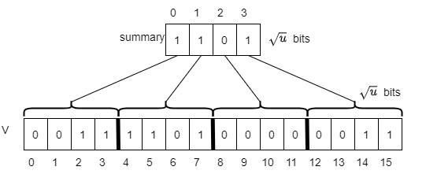
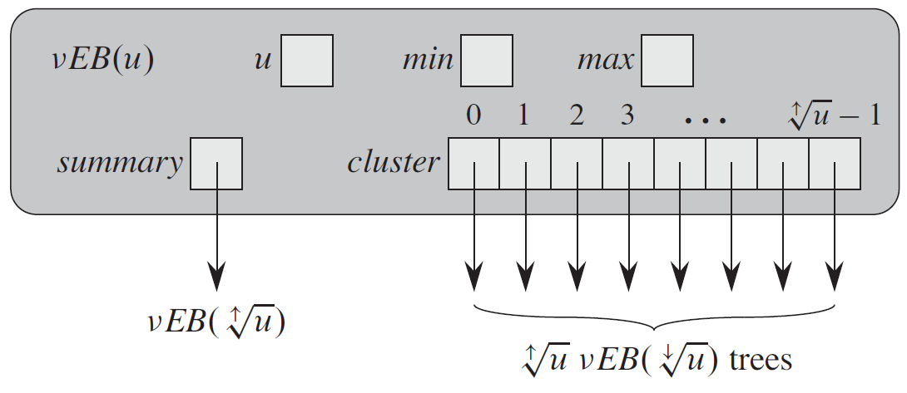
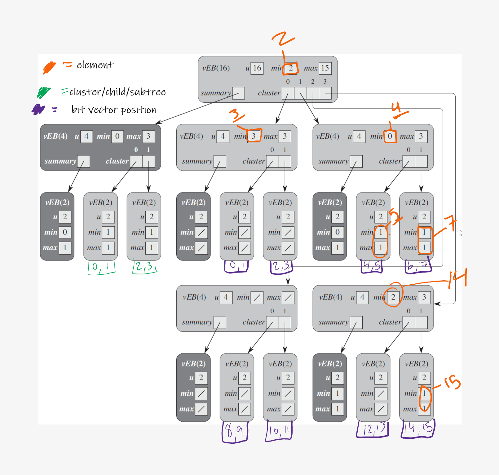
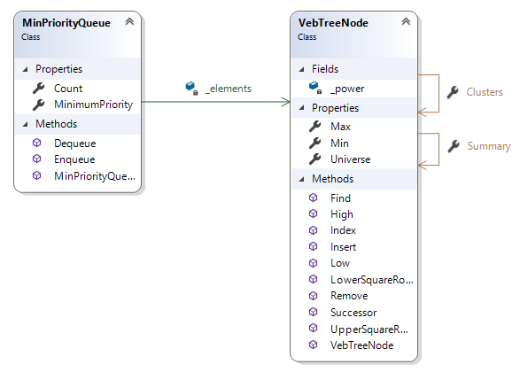

# User Requirements

The task for this assignment is to implement a minimum priority queue implemented using a van Emde Boas tree.  The algorithms described below are adapted from *Introduction to Algorithms - 3rd edition* by Corman, T.H, Leiserson, C.E., Rivest, R.L., and Stein, C.

## van Emde Boas Trees

The van Emde Boas tree, aka vEB tree, is a tree that utilizes an associative array with $u$-bit integer keys.  This data structure is very efficient in operations it is able to perform (this includes search, predecessor, successor, insert, and delete).  Each of these operations are performed in $O($lg lg $u)$ time where $u$ is referred to as the universe of keys or maximum number of keys that can be stored.  vEB trees are bounded by this universe, so the tree will always take up space of size $u$ and once created, cannot be grown or shrunk (there are some alternatives to help get around this problem, but they are not explored in this implementation).  This makes vEB trees very efficient in terms of space when the tree is full, but not so much when the tree is sparse.  This, along with the restriction that keys may only be positive integers, make the vEB tree impractical for many applications.  However, due to its construction, it can be used to implement a priority queue faster than normal heap implementations. 

A vEB tree is constructed by segmenting its universe into $\sqrt{u}$ vEB trees, where each subtree would be responsible for containing keys $i\sqrt{u}$ through $(i+1)\sqrt{u}-1$.  Since the structure is implemented recursively, at each level of the tree, the universe shrinks by a factor of $\sqrt{u}$. We can start to sketch out the basis of this segmentation like so:

In the above image, we have a 16 element universe where the bit $1$ indicates the presence of the corresponding number.  As such,  we can see that the above image contains the *set* of numbers ${2,3,4,5,6,14,15}$.  The contents of the summary node indicate whether the corresponding child is nonempty – a 0 denotes an empty child, and a 1 denotes a nonempty child

The above structure could still be more efficient though.  By making it a recursive tree structure, we can reduce the universe in each level by $\sqrt{u}$, where $u = 2^k$.  This would leave the root to have a universe of size $\sqrt{u}$, then down one level, the universe would be of size $u^{1/4}$ then $u^{1/8}$… all the way down until $u = 2$. This works well for even powers of two; however, the square root of any odd power of 2 is not a whole number.  Rounding up (ceiling, denoted by $\left \lceil{value}\right \rceil $) or rounding down (floor denoted by $\left \lfloor{value}\right \rfloor $ )  doesn't always produce a universe that is a power of two.  For example, $\sqrt{8}=2.83$ rounded up or rounded down would not give the root node the correct universe.  In order to allow odd powers of 2, we need to define the root of our tree to have a universe equal to the upper square root of $u$ (defined as $2^{\left \lceil{k/2}\right \rceil }$), pointing to the upper square root of $u$ subtrees containing a universe equal to the lower square root of $u$ (defined as $2^{\left \lfloor{k/2}\right \rfloor }$).  

We also keep track of the minimum and maximum element within each tree node. Note that an element stored in *min* is not stored in any child of that node if the tree contains two or more elements, but the element stored in *max* does.  We also store with each node a summary, which is another vEB tree storing as its keys the indices of the nonempty subtrees of the node. Note that its universe is therefore the upper square root of u. When an element is inserted into a subtree that is empty, the index of that subtree is also inserted into the summary.  For nodes where $u = 2$ (i.e. leaf nodes), we can use $min$ and $max$ to store the elements, therefore all leaves will have a null summary and cluster. The vEB tree node structure can be seen below (*Note that clusters can also be referred to as **subtrees** or **children***). The notation $vEB(u)$ indicates a vEB tree node with universe size $u$.

But how do we know where any element gets placed within a tree? To do this, we will utilize three different functions:
$$
high(key) = \left \lfloor{key/lowerSqrt(u)}\right \rfloor\\
low(key) = key\ \%\ lowerSqrt(u)\\
index(subtree,offset) = subtree*lowerSqrt(u) + offset
$$
These functions help segment out the bits in each level.  We want to separate them into least significant and most significant bits in order to determine where a given key is placed. The $high$ function references the most significant $\left \lfloor{k/2}\right \rfloor $ bits, which tells us what subtree/cluster the $key$ belongs to.  The $low$ function references the least $\left \lceil{k/2}\right \rceil $significant bits, which tells us the position of $key$ within that subtree (i.e., low(key) is the key added to this subtree).  Finally, $index$ will compute the value of a key given the index of the subtree and the position of that key within that subtree, treating the $subtree$ index as the most significant bits and $offset$ as the least significant bits of the element.  

We can see how these work in a vEB tree that contains the following set of numbers: $2,3,4,5,7,14,15$.The writing in orange gives the original key represented by a value. For example, 7 is expressed as a 4-bit binary number as 0111. The high-order portion tells us that it belongs in subtree 1 of the root. Its value in this node is 3 (the low-order half of 7, or 11 in binary). The high-order part of 11 tells us it is stored in subtree 1 of this subtree, and the low-order portion tells us it is stored as the value 1 in this node.  Green writing indicates the cluster that the summary corresponds to.  And purple writing indicates the position in the original bit vector from our earlier image.  A slash indicates that that value has not been set (in our implementation, that would be -1).

## Starting the Assignment

Begin by creating a GitHub repository using [**this URL** ](https://classroom.github.com/a/0RcWyOvv), and clone it to your local machine. This repository contains a new C# library for a vEB tree priority queue and test cases.

## Software Architecture

Your program should contain these four classes, as shown in the following class diagram.  

## Code Requirements

Your program should be organized into the following classes.  Note that many things here are made public (not all) in order to improve accessibility for unit testing. It is important to name everything as listed since the provided unit tests will be expecting them as such.  You may add additional private methods to any of the classes that help you with your implementation.

### VebTreeNode Class

#### Properties

- `public int Min`:  This property stores the smallest key in this tree.  This should have a public get accessor and a private set accessor using the default implementation.
- `public int Max`:  This property stores the largest key in this tree.  This should have a public get accessor and a private set accessor using the default implementation.
- `public VebTreeNode[] Clusters`:  This property stores subtrees that correspond to clusters of bits in the vEB Tree.  The number of subtrees is equal to the upper square root of the universe for a universe greater than 2.  For a universe of size 2, no clusters are stored.   This  property should have a public get accessor and a private set accessor using the default implementation.
- `public VebTreeNode Summary`:  This property stores an auxiliary tree that keeps track of which clusters contain elements.  This should have a public get accessor and a private set accessor using the default implementation.
- `public int Universe`:  This property keeps track of maximum number of bits/keys this tree can contain.  This should have a public get accessor and a private set accessor using the default implementation.

#### Fields

- `private int _power`: This private field stores the power of 2 the tree's universe.  In the discussion of the vEB tree earlier, this field represents $k$ in $2^k$.

#### Methods

- `public double LowerSquareRoot()`:  This method calculates the lower square root of the `Universe` as defined in $2^{\left \lfloor{k/2}\right \rfloor }$
- `public int UpperSquareRoot()`:  This method calculates the lower square root of the `Universe`, cast as an integer, as defined in $2^{\left \lceil{k/2}\right \rceil }$

#### Constructors

- `public VebTreeNode(int universeSize)`:  This is the only constructor for the VebTreeNode class.  Since the structure of a vEB tree is dependent on the size of its universe, once a tree is created, the size of its universe cannot be changed.  The universe should be restricted to only positive powers of 2.  If it is not, an `ArgumentException` should be thrown.  You can check for this in a couple of ways: you can do a bit-wise and between the universe and the universe - 1.  If this result is is not 0, then it is not a power of 2.  You can also compare $\left \lfloor{\log_2universe}\right \rfloor$ to $\left \lceil{\log_2universe}\right \rceil$.  If they differ, then it is not a power of 2.  Note that in each of these ways, you will need to have a special case for 0.

    Since no elements have been inserted into the tree at this point, `Min` and `Max` should be initialized to -1.  If the Universe is less than or equal to 2, then this node does not need a `Summary` or `Clusters`.  Otherwise, the length of `Clusters` and the universe of `Summary` is equal to the upper square root of `Universe`.  Each subtree contained in `Clusters` should be initialized to a `VebTreeNode` with a universe equal to the lower square root of `Universe`.

#### Methods (continued)

- `public int High(int key)`: returns which subtree the given key belongs to as described in the earlier "van Embde Boas Trees" section.

- `public int Low(int key)`: returns the position the given key is at within a subtree as described in the earlier "van Embde Boas Trees" section.

- `public int Index(int subtree, int offset)`: returns the element based from the given subtree and offset values  as described in the earlier "van Embde Boas Trees" section.

- `public void Insert(int key)`: This recursive method inserts the given key into the tree.  The key must be a positive integer that is strictly less than the `Universe`.  If it is not, an argument exception should be thrown.  

    - If the value of `Min` has not been set, then this key is the first element to be inserted into this node, therefore we only need to set the min and max to the value of the key.
    - Otherwise, if the key is strictly less than the minimum element, then the key is the new smallest element so swap it with `Min` (i.e. key becomes the new `Min` and `Min` becomes the key we are inserting).
    - If we are on an internal tree node (the universe is larger than 2), then we need to calculate which cluster the key should be inserted into (utilize the `High` and `Low` functions above).  If this is the first key to be inserted into the corresponding cluster, then the index of that cluster should be inserted into the `Summary`.   Recursion should be used to insert into the summary and cluster.  Note that you are not strictly inserting the key into the cluster, but the position of the key within that cluster.
    - Lastly, if the key being inserted is larger than the current maximum element, update `Max`.

- `public bool Find(int key)`:  This recursive method searches the tree to determine whether or not the given key exists in this tree.  If the key is larger than or equal to the universe, then return false as this key is outside the possible universe of keys this tree can hold.  If the `Min` or `Max` are equal to the key, then this key exists in the tree, but if not, and the universe is of size 2, then the key does not exists in this tree.  Otherwise, we recursively call `Find` on the key's corresponding cluster, passing the position of the key in that cluster as a parameter (utilize the `High` and `Low` functions).

- `public int Successor(int key)`:  This recursive method returns the next largest key stored in the tree after the given key.  If no successor is found, then -1 is returned.  Note that this key does not have to be in the tree in order for it to have a successor.

    This method has two base cases.  The first base case is that the universe is of size 2. Then if the key is 0 and Max is 1, then the successor must be 1; otherwise, no successor exists. (because if the key is 1 then no element exists here larger than the key, similar reasoning applies if the key is 0 but the Max is not set).  The second base case, when the universe is not of size 2, is that if the key is greater than -1 but less than `Min`, then the `Min` is key's successor.  
    
    Otherwise the successor may be contained in the subtree containing the the key.  Compute the index of the subtree by utilizing the `High` method.  If the subtree at this index has `Max` defined and the position of the key (utilize the `Low` method) is less than this maximum then the successor is somewhere in that subtree, then to compute that successor, we will utilize the `Index` method, where the offset is the result of recursively calculating the  successor of the position of the original key within the subtree.  
    
    Otherwise, if the key's position in the subtree is greater or equal to than the subtree's maximum, then we compute the successors cluster (referred to as *successorClusterIndex*) by recursively calculating the successor of the subtree index within the `Summary`.  If *successorClusterIndex* is -1 then no successor exists.  Otherwise, the successor is found by by calling the `Index` method, using the *successorClusterIndex* as the subtree and the `Min` value contained in the subtree located at *successorClusterIndex* as the offset.
    
- `public void Remove(int keyToRemove)`: This recursive method handles removing the given key from the tree.  

    - This method has two base cases First, if the minimum and maximum elements are the same and the *keyToRemove* is equal to `Min`, then *key* is the last element being removed in this node, so `Min` and `Max` should be reset to -1.  Otherwise, if the universe size is 2, then we are removing the key from a leaf node, so `Min` and `Max` get set to the remaining value (this would be either 0 or 1).

    - *(recursive case)* Otherwise we will need to find where the *key* is located in the tree.  If the minimum element in this node is the key, then we will be deleting the minimum value.  As such, we will need to replace `Min` by the next smallest element in the cluster.  This is done by using the `Index` method, where subtree is the minimum element (*referred to as minIndex in this description*) in the `Summary` and the offset is the minimum value of the cluster located at *minIndex*.  The value returned by `Index` is not only the new `Min`, but it is also the new key we need to remove.  (Remember that the minimum value is not stored anywhere in a vebTree's children, so we will need to remove it)

        We can now recursively remove the `keyToRemove` from its corresponding cluster (note that when recursively calling Remove here, you will need to pass the *position* of the key in the cluster, not the key itself).

        After the key has been removed, we will need to do a couple of checks.  First, if the key removed was the last in its cluster, then we also need to remove that cluster from the summary.  If this is the case, we need will also need to update `Max`.  If the Summary's maximum element is -1, then `Max` gets set to `Min`.  Otherwise `Max` should be set to the maximum element in the highest numbered cluster (calculated using the `Index` method, using `Summary.Max` as the subtree and the `Max` of the cluster located at `Summary.Max`).  

        Otherwise, if the key that we removed was this node's `Max`, then we just deleted the maximum element.  `Max` should then be replaced by the next largest element in the cluster (calculated using the `Index` method, using the subtree index of the key we removed and that subtree's `Max`).

### MinPriorityQueue Class

The **MinPriorityQueue ** class is a public class that implements a minimum priority queue utilizing a vEB tree.  Note that our queue can only store positive integers due to the restriction of the vEB tree implementation.

#### Fields

- `private VebTreeNode _elements`:  This field stores the vEB tree that represents all the elements in the minimum priority queue.

#### Properties

- `public int MinimumPriority`:  This property has only a get accessor that returns the minimum element from the vEB tree.  If the queue is empty, this property should throw an `InvalidOperationException`.
- `public int Count`: This property keeps track of how many elements are in the queue.  This should have a public get accessor and a private set accessor using the default implementation.

#### Constructors

- `MinPriorityQueue(int maxSize)`:  The constructor of this class takes in the maximum number of elements the queue can have as a parameter.  This is used to initialize the vEB tree stored in `_elements`. 

#### Methods

- `public void Enqueue(int num)`:  This method inserts the given number into the queue.
- `public void Dequeue(int num)`:  This method removes the element with the minimum priority (the smallest element) from the queue and returns it.  This method should throw an InvalidOperationException if there are no elements in the queue.

### Testing

The unit tests given with this project provide high code coverage for both the MinPriorityQueue and the VebTreeNode classes.  However, passing all of the test cases does not guarantee 100% on the homework assignment. The torture tests that verify efficiency of your solution should be able to be ran successfully on the remote desktop server within the allotted time.  Most computers will be able to complete those tests well under the time limits.

## Submitting Your Assignment

Be sure you **commit** all your changes and **push** your commits to your GitHub repository. (**Note:** Prior to committing changes, it is a good idea to refresh the Team Explorer by clicking the circular arrow icon at the top.) Then submit the *entire URL* of the **commit** that you want graded. There is no need to submit a comment, as you will not have a completion code.

**Important:** If the URL you submit does not contain the 40-hex-digit fingerprint of the commit you want graded, **you will receive a 0**, as this fingerprint is the only way we can verify that you completed your code prior to submitting your assignment. We will only grade the source code that is included in the commit that you submit. Therefore, be sure that the commit on GitHub contains all four ".cs" files, and that they are the version you want graded. This is especially important if you had any trouble committing or pushing your code.